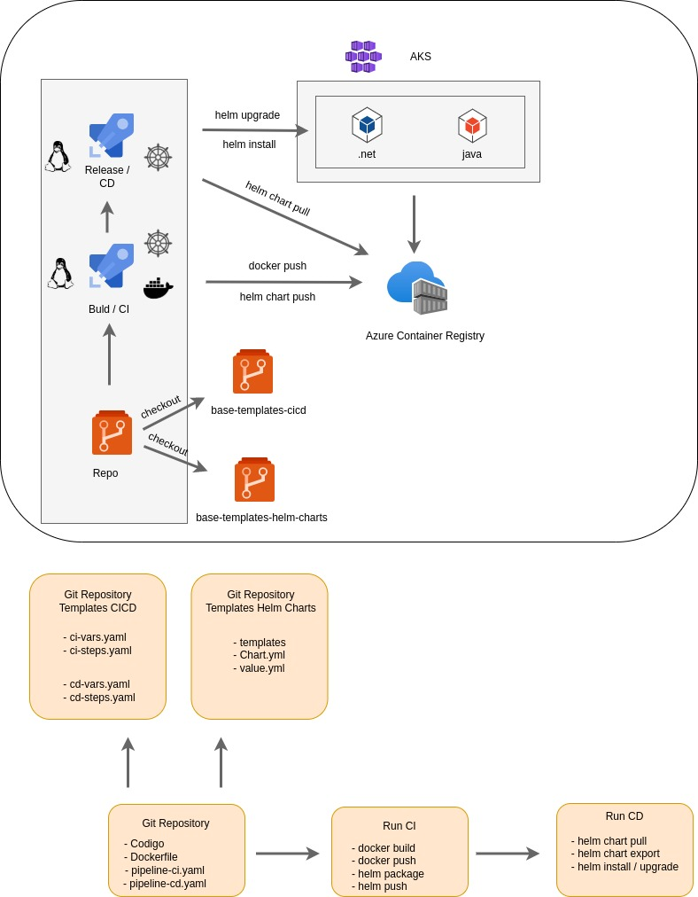

<h1 align="center">Templates pipeline CI/CD</h1>

<p align="center">
  

  
</p>


## 🛠️ Objetivo

- Repositório utilizado para armazenar templates de pipelines.

## ✨ Arquitetura




## 🚀 Pipeline CI

- Etapas do pipeline `ci-steps-template.yml`

        - Crie e envie a imagem do docker
        - Instala o cliente Helm
        - Autenticar no ACR
        - Cria e envia o gráfico do Helm para o ACR.
        - Cria variables.jsonque contém a versão do gráfico do Helm recém-criada. Que usaremos para obter a versão correta do gráfico durante o CD.
        - Copie alguns arquivos adicionais para o artefato. Que podemos usar para substituir os valores do gráfico do Helm.

## 🚀 Pipeline CD

- Etapas do pipeline `cd-steps-template.yml`

        - Autentique-se no Azure usando as credenciais principais de serviço
        - Defina o cluster AKS especificado como o contexto.
        - Instala o cliente Helm
        - Autentique o ACR com as credenciais do ACR 
        - Extraia a versão do gráfico do Helm que precisa ser instalada
        - Puxa o gráfico do Helm e o instala (ou atualiza). Aqui, estamos substituindo o repositório de imagens do gráfico para nosso repositório ACR.

## 📝 Requisitos


| ACR | Ter um acr configurado |
| --- |---------- |
| acr-varibles-group | Credenciais definidas em um grupo de variáveis |
| `registryName` |  Seu ACR name     |
| `registryLogin` |  ACR login     |
| `registryPassword` |  ACR password     |


| AKS | Ter um aks configurado |
| --- |---------- |
| aks-varibles-group | Credenciais definidas em um grupo de variáveis |
| `aks` |  AKS name     |
| `rg` |  AKS resource group     |
| `aksSpTenantId` |  Subscription tenant id     |
| `aksSpId` |  Service principal Id     |
| `aksSpSecret` |  Service principal password     | 

| Service Connection | Criar um service connection para o ACR |
| --- |---------- |
| Name  | Service Connection |
| acr-connection-aks | Azure Container Registry |

## Comandos úteis

- Criar um novo principal de serviço `aks-name-deploy`

```bash
az ad sp create-for-rbac -n aks-name-deploy --scopes aks-resource-id --role "Azure Kubernetes Service Cluster User Role" --query password -o tsv
```

- O comando acima irá gerar uma saída mais ou menos assim:
```
{
  "appId": "00000000-0000-0000-0000-0000000000000",
  "displayName": "aks-name-deploy",
  "name": "0000000-0000-0000-0000-0000000000",
  "password": "00000000000000-00000000000000000",
  "tenant": "00000000-0000-0000-0000-00000000000"
}
```

- Anexe ACR com AKS
```bash
az aks update -g $rg -n $aks --attach-acr acr-resource-id
```
